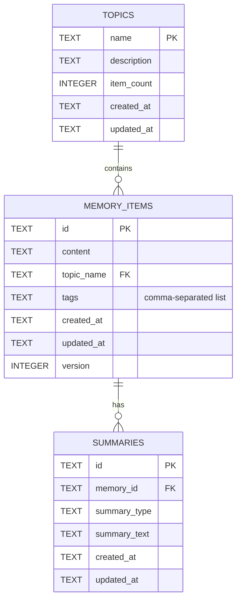

# Database Schema Documentation

Comprehensive view of the SQLite + Chroma hybrid storage model. This document focuses on the **SQLite** relational schema (authoritative structured store) and conceptual linkage to **ChromaDB** collections.

## Entity Relationship (SQLite)



## Table Specifications

### 1. `topics`

| Column        | Type    | Constraints    | Description                                                    |
| ------------- | ------- | -------------- | -------------------------------------------------------------- |
| `name`        | TEXT    | PRIMARY KEY    | Unique topic identifier.                                       |
| `description` | TEXT    | NULLABLE       | (Currently unused placeholder) Optional human description.     |
| `item_count`  | INTEGER | DEFAULT 0      | Count of memory items referencing the topic. Updated manually. |
| `created_at`  | TEXT    | NOT NULL (ISO) | Creation timestamp.                                            |
| `updated_at`  | TEXT    | NOT NULL (ISO) | Last modification timestamp.                                   |

Notes:

- Primary key index is implicit. Performance indices are implemented in the initialization phase (see below).

### 2. `memory_items`

| Column       | Type    | Constraints                 | Description                                 |
| ------------ | ------- | --------------------------- | ------------------------------------------- |
| `id`         | TEXT    | PRIMARY KEY                 | UUID for the memory record.                 |
| `content`    | TEXT    | NOT NULL                    | Full original stored content.               |
| `topic_name` | TEXT    | NOT NULL, FK -> topics.name | Topic association (ON DELETE CASCADE).      |
| `tags`       | TEXT    | NULLABLE                    | Comma-separated list of tags (no escaping). |
| `created_at` | TEXT    | NOT NULL (ISO)              | Creation timestamp.                         |
| `updated_at` | TEXT    | NOT NULL (ISO)              | Last update timestamp.                      |
| `version`    | INTEGER | DEFAULT 1                   | Incremented on each update.                 |

Notes:

- Indices implemented: `idx_memory_items_topic` for topic-based queries and `idx_memory_items_created` for time-based queries.
- Potential future improvements: full-text index (FTS5) for hybrid lexical + semantic search, normalized tag table.
- Referential integrity enforced: `PRAGMA foreign_keys=ON` is enabled on every SQLite connection.

### 3. `summaries`

| Column         | Type | Constraints                     | Description                                  |
| -------------- | ---- | ------------------------------- | -------------------------------------------- |
| `id`           | TEXT | PRIMARY KEY                     | UUID for summary entry.                      |
| `memory_id`    | TEXT | NOT NULL, FK -> memory_items.id | Parent memory reference (ON DELETE CASCADE). |
| `summary_type` | TEXT | NOT NULL                        | Classification (e.g. `abstractive_medium`).  |
| `summary_text` | TEXT | NOT NULL                        | Generated summary content.                   |
| `created_at`   | TEXT | NOT NULL (ISO)                  | Creation timestamp.                          |
| `updated_at`   | TEXT | NOT NULL (ISO)                  | Last update timestamp.                       |

Notes:

- Composite index `idx_summaries_memory_type` on `(memory_id, summary_type)` is implemented for efficient queries and uniqueness enforcement.

## ChromaDB Collections (Conceptual)

While not relational, Chroma stores metadata alongside embeddings:

| Collection     | Document Source             | Key Metadata Fields                  |
| -------------- | --------------------------- | ------------------------------------ |
| `memory_items` | Full memory `content`       | `id`, `topic`, `tags`, timestamps    |
| `summaries`    | Generated `summary_text`    | `memory_id`, `summary_type`, `topic` |
| `topics`       | Synthetic topic description | `name`, `tags`                       |

Alignment Rules:

- SQLite `memory_items.id` ↔ Chroma `memory_items` `id` field.
- SQLite `summaries.id` ↔ Chroma `summaries` `id` field.
- SQLite `summaries.memory_id` ↔ Chroma summary metadata `memory_id`.
- Topics mirrored by name.

## Data Flow Summary

1. Insert memory → row in `memory_items` → embedding in Chroma `memory_items`.
2. Auto summary → row in `summaries` → embedding in Chroma `summaries`.
3. Retrieval → semantic search summaries → hydrate memory from SQLite.
4. Update memory → SQLite row updated (version++) → Chroma document updated → summary regenerated (if content changed).
5. Delete memory → cascade delete summaries (SQLite) → explicit delete memory + summary embeddings (Chroma).

## Integrity & Risk Notes

- **Foreign key enforcement:** `PRAGMA foreign_keys=ON` is enabled on every SQLite connection to prevent orphaned rows.
- **Dual-write inconsistency risk:** Writes to SQLite and Chroma are not atomic across both stores. Consider implementing reconciliation or a write-ahead queue for mission-critical applications.
- **Tag serialization:** Currently stored as comma-separated values; tags containing commas will break splitting logic. Consider migrating to JSON or a normalized tag table for robustness.

## Suggested Enhancements

| Area                  | Recommendation                                                                               |
| --------------------- | -------------------------------------------------------------------------------------------- |
| Tags Model            | Store as JSON or separate table (`memory_tags(memory_id, tag)`) for robustness with special characters. |
| Full-Text Search      | Add FTS5 virtual table for hybrid lexical + semantic search fallback.                        |
| Observability         | Add change log table for audit/version history tracking.                                     |
| Consistency           | Implement reconciliation script comparing SQLite IDs vs Chroma IDs for dual-write validation. |

## Quick Reference SQL

(Already implemented in initialization; shown for reference)

```sql
-- Foreign keys are enabled per-connection in SQLiteConnection
PRAGMA foreign_keys = ON;

-- Indices created during initialization
CREATE INDEX IF NOT EXISTS idx_memory_items_topic ON memory_items(topic_name);
CREATE INDEX IF NOT EXISTS idx_memory_items_created ON memory_items(created_at);
CREATE INDEX IF NOT EXISTS idx_summaries_memory_type ON summaries(memory_id, summary_type);

-- Future enhancement: Full-text search
-- CREATE VIRTUAL TABLE memory_items_fts USING fts5(content, content='memory_items', content_rowid='rowid');
```

_Last updated: 2026-01-28_
